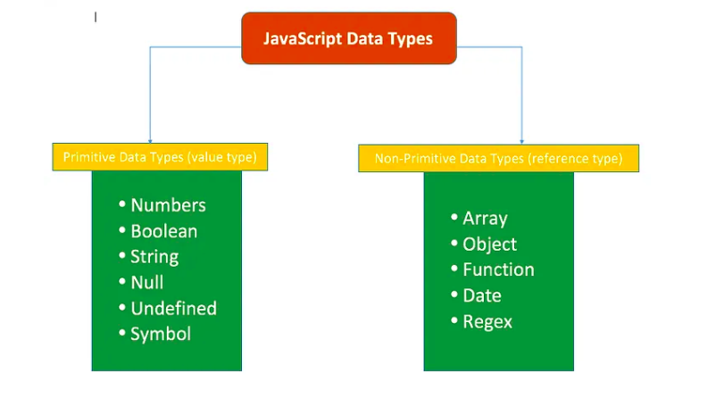

# Mutable and Immutable Types in JavaScript



In JavaScript, every variable stores an instance of an object or primitive value.

- **Variables** hold references to objects or values.
- **Objects and values** live in concrete memory positions.

### 1. Primitive Values:

Primitive types in JavaScript include undefined, null, boolean, number, bigint, string, and symbol.
These are immutable and stored directly in the **stack**.

### 2. Objects:

Objects include arrays, functions, and any user-defined objects.
They are stored in the **heap**.

## Object Storage of Various Variables

```javascript
let a = 10;
let b = "Bhaskar";
let c = [1, 2, 3];

let x = ["mango", "apple", "grapes"];
let y = { name: "Satyam", age: 44 };
let z = new Set([4, 5, 6]);
```

In programming, a mutable object allows you to modify its internal state after creation. In contrast, an immutable object cannot have its state changed after it is created. Whether or not you can change an object's state defines its mutability.

---

## 1. Basics of Memory Referencing in JavaScript

### Immutable Type

```javascript
let a = "Hello Everyone";
let b = a;

console.log(a, b); // Same value

a = "Let's Start";

console.log(a, b); // Different value due to immutability

b = "Bye Everyone";

console.log(a, b);
```

### Mutable Types

```javascript
let userData = {
  name: "Vimal",
  age: 24,
  email: "vimal24@gmail.com",
};

let userDataCopy = userData;

userDataCopy.age = 45;

console.log(userData); // Original object is also updated
console.log(userDataCopy);
```

---

## 2. **Examples of Mutable Types**

### **Array (Mutable)**

```javascript
let myArray = [1, 2, 3];
console.log(myArray);
myArray[0] = 100;
console.log(myArray);
myArray.push(4);
console.log(myArray);
```

- **Explanation**: Arrays are mutable, so you can change their elements, add new elements, or remove elements without creating a new array.

### **Object (Mutable)**

```javascript
let myObject = { a: 1, b: 2 };
console.log(myObject);
myObject.a = 10;
console.log(myObject);
myObject.c = 30;
console.log(myObject);
```

- **Explanation**: Objects allow modification of key-value pairs, adding new keys, or deleting existing ones without creating a new object.

### **Set (Mutable)**

```javascript
let mySet = new Set([1, 2, 3]);
console.log(mySet);
mySet.add(4);
console.log(mySet);
mySet.delete(2);
console.log(mySet);
```

- **Explanation**: Sets are mutable, allowing you to add or remove elements, though the order is not preserved.

---

## 3. **Examples of Immutable Types**

### **Primitive Types (Immutable)**

#### **Number**

```javascript
let x = 5;
let y = x;
console.log(x, y);
x = x + 1;
console.log(x, y);
```

- **Explanation**: Numbers are immutable. Modifying the value creates a new number object.

#### **String**

```javascript
let s = "hello";
let sCopy = s;
console.log(s, sCopy);
s = s + " world";
console.log(s, sCopy);
```

- **Explanation**: Strings are immutable. Any operation that modifies a string creates a new string object instead of modifying the original.

#### **Frozen Objects (Immutable)**

```javascript
const obj = Object.freeze({ a: 1, b: 2 });
console.log(obj);
// obj.a = 10; // Error: Cannot assign to read-only property
```

- **Explanation**: Freezing an object prevents modification of its properties.

---

## 4. **How to Make Mutable Types Immutable**

### Freezing Objects

```javascript
const user = { name: "John", age: 30 };
Object.freeze(user);

// Attempt to modify the object
user.age = 35; // Error in strict mode
console.log(user);
```

### Deep Freeze

```javascript
const deepFreeze = (obj) => {
  Object.freeze(obj);
  Object.keys(obj).forEach((key) => {
    if (
      obj[key] !== null &&
      typeof obj[key] === "object" &&
      !Object.isFrozen(obj[key])
    ) {
      deepFreeze(obj[key]);
    }
  });
};

const nestedObj = { a: { b: 2 }, c: 3 };
deepFreeze(nestedObj);
nestedObj.a.b = 10; // Error in strict mode
console.log(nestedObj);
```

### Using Libraries

Immutable.js or immer.js can help enforce immutability programmatically.

```javascript
const { fromJS } = require("immutable");
const data = fromJS({ a: 1, b: 2 });
console.log(data);
// data.a = 10; // Error: Immutable map does not allow direct changes
```

---

## Summary of Techniques

| **Concept**             | **Mutable Types** (e.g., `Array`, `Object`, `Set`)          | **Immutable Types** (e.g., `Number`, `String`, `Frozen Object`) |
| ----------------------- | ----------------------------------------------------------- | --------------------------------------------------------------- |
| **Modification**        | Can be modified in place (e.g., push, pop, update).         | Cannot be modified once created.                                |
| **Assignment**          | Changes to variables create references to the same object.  | Changes to variables create new objects.                        |
| **Copying**             | Can create shallow or deep copies.                          | Always creates a new object.                                    |
| **Methods for Copying** | `slice()`, `spread operator`, or libraries for deep copies. | Direct assignment or new instantiation.                         |
| **Identity**            | Multiple variables can refer to the same object.            | Immutable objects maintain separate instances.                  |
| **Iteration**           | Can modify elements during iteration.                       | Cannot modify elements during iteration.                        |
| **Memory Usage**        | Lower memory footprint for repeated modification.           | Higher memory footprint due to immutability.                    |
| **Comparison by Value** | Compared by reference.                                      | Compared by value.                                              |
| **Use Case**            | Useful when data needs to change over time.                 | Useful when data should remain constant.                        |

---
