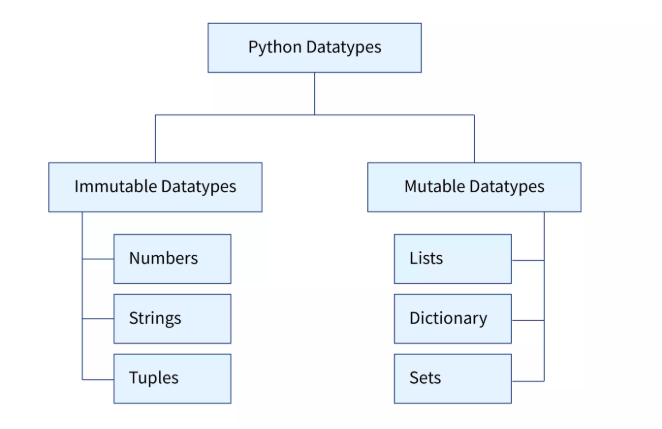

# Mutable and Immutable Types



In Python, every variable stores an instance of an object...

- **Variables** hold references to objects.
- **Objects** live in concrete memory positions.

### Object Storage of varius variables -

```
a = 10
b = "Bhaskar"
c = (1, 2, 3)
```

```
x = ['mango', 'apple', 'grapes']
y ={"name" : "Satyam", "age" : 44}
z = {4, 5, 6}
```

In programming, you have an immutable object if you can’t change the object’s state after you’ve created it. In contrast, a mutable object allows you to modify its internal state after creation. In short, whether you’re able to change an object’s state or contained data is what defines if that object is mutable or immutable.

## 1. BASIC OF MEMORY REFERENCING IN PYTHON

### Immutable Type

```python
a = 'Hello Everyone'
b = a

print(id(a), id(b))

a = "Let's Start"

print(id(a), id(b))

b = "By Everyone"

print(id(a), id(b))

```

### Mutable Types

```python
userData ={
    "name" : "Vimal",
    "age" :24,
    "email" : "vimal24@gmail.com"
    }

userDataCopy = userData

userDataCopy["age"] = 45

print(userData)
print(userDataCopy)
```

## 2.**Examples of Mutable Types**

#### **List (Mutable)**

```python
my_list = [1, 2, 3]
print(id(my_list))
my_list[0] = 100
print(id(my_list))
my_list.append(4)
print(id(my_list))
```

- **Explanation**: Lists are mutable, so you can change their elements, add new elements, or remove elements without creating a new list.

#### **Dictionary (Mutable)**

```python
my_dict = {"a": 1, "b": 2}
print(id(my_dict))
my_dict["a"] = 10
print(id(my_dict))
my_dict["c"] = 30
print(id(my_dict))
```

- **Explanation**: Dictionaries allow modification of key-value pairs, adding new keys, or deleting existing ones without creating a new dictionary.

#### **Set (Mutable)**

```python
my_set = {1, 2, 3}
print(id(my_set))
my_set.add(4)
print(id(my_set))
my_set.remove(2)
print(id(my_set))
```

- **Explanation**: Sets are mutable, allowing you to add or remove elements, though the order is not preserved.

**Frozenset (immutable version of set)**:

```python
s = frozenset([1, 2, 3])
s_copy = s
print(id(s), id(s_copy))
s = frozenset([1,2,3,4])
print(id(s), id(s_copy))

# s.add(4)  # Error: 'frozenset' object has no attribute 'add'
```

---

## **3. Examples of Immutable Types**

#### **Integer (Immutable)**

```python
x = 5
y = x
print(id(x), id(y))
x = x + 1
print(id(x), id(y))
```

- **Explanation**: Integers are immutable. Modifying the value creates a new integer object, and the original object remains unchanged.

#### **String (Immutable)**

```python
s = "hello"
s_copy = s
print(id(s), id(s_copy))
s = s + " world"
print(id(s), id(s_copy))
```

- **Explanation**: Strings are immutable. Any operation that modifies a string creates a new string object instead of modifying the original.

#### **Tuple (Immutable)**

```python
my_tuple = (1, 2, 3)
my_tuple_copy = my_tuple
print(id(my_tuple), id(my_tuple_copy))
my_tuple = my_tuple + (4,)
print(id(my_tuple), id(my_tuple_copy))
```

- **Explanation**: Tuples are immutable, meaning you cannot modify their elements. Any "modification" creates a new tuple.

## **4. Key concepts**

#### **Shallow Copy Vs Deep Copy (List)**

```
original_list = [1,2,3,4,5,6]
shallow_copy = original_list
deep_copy = [item for item in original_list]
print(id(original_list), id(shallow_copy), id(deep_copy))
deep_copy[2] = 'deep_copy'
print(f"Deep Copy : {deep_copy}, \nOriginal Copy: {original_list} ")
shallow_copy[2] = 'shallow_copy'
print(f"Shallow Copy : {shallow_copy}, \nOriginal Copy: {original_list} ")
```

## Summary of Techniques

| **Concept**                | **Mutable Types** (e.g., `list`, `dict`, `set`)              | **Immutable Types** (e.g., `int`, `tuple`, `str`, `frozenset`)      |
| -------------------------- | ------------------------------------------------------------ | ------------------------------------------------------------------- |
| **Modification**           | Can be modified in place (e.g., append, remove, update).     | Cannot be modified once created (e.g., cannot change elements).     |
| **Assignment**             | Changes to variables create references to the same object.   | Changes to variables create new objects.                            |
| **Copying**                | Can create shallow or deep copies.                           | Creating copies always creates a new object (shallow copy).         |
| **Methods for Copying**    | `copy()`, slicing, or `copy.deepcopy()` for deep copies.     | Direct assignment is often used as "copying" for immutable types.   |
| **Identity**               | Multiple variables can refer to the same object.             | Multiple variables cannot modify the same object.                   |
| **Examples of Techniques** | `append()`, `extend()`, `pop()`, `remove()`, `del`, etc.     | Concatenation, slicing, `+`, `*` operations (creates new objects).  |
| **Iteration**              | Can modify elements during iteration (but can cause errors). | Cannot modify elements during iteration.                            |
| **Memory Usage**           | Can have smaller memory footprint as they are mutable.       | Have a higher memory footprint due to object immutability.          |
| **Comparison by Value**    | Lists, dicts, and sets compared by their contents.           | All immutable types compared by their value.                        |
| **Use Case**               | Useful when data needs to change over time.                  | Useful when data should remain constant and safe from modification. |
